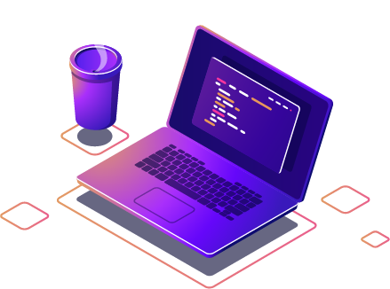

# Sobre mim 
Dev BackEnd

## Projetos recentes:

### Conecte-se comigo
  

  <!-- https://shields.io/ #ALTERAÇÃO DAS BADGES -->

 
  

      

 
 

  #  Skills
 
 
 

 ### Linguagens de Marcação e Estilo

### Linguagens de Programação

  

### Bibliotecas e Frameworks

  

### Banco de Dados

### Ferramentas

  

 

 

# Estatísticas Github
  

  
<!--    VERSÃO COMPLETA -->

  

  
<!--   -->

 

 

##

   
                                 
 <!-- 
      

      
 -->

